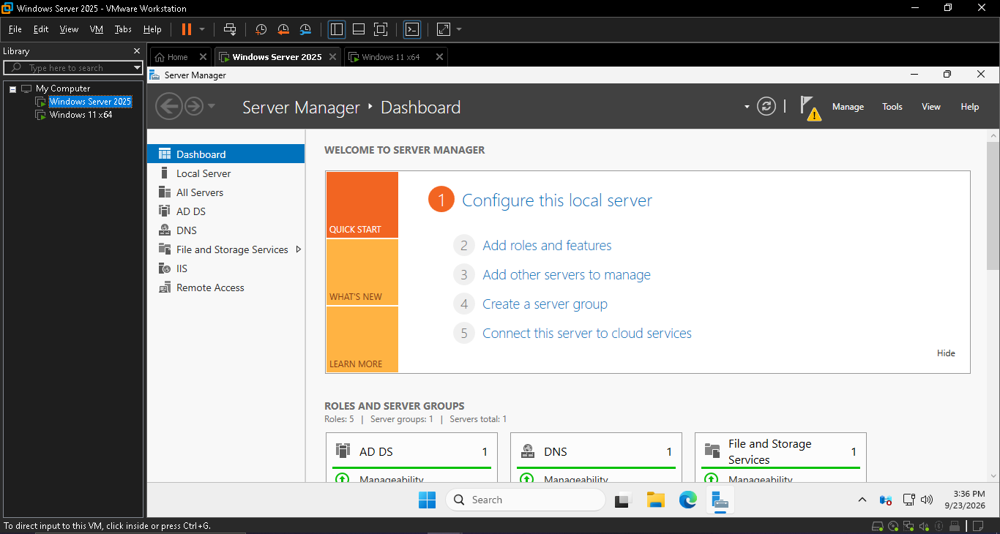
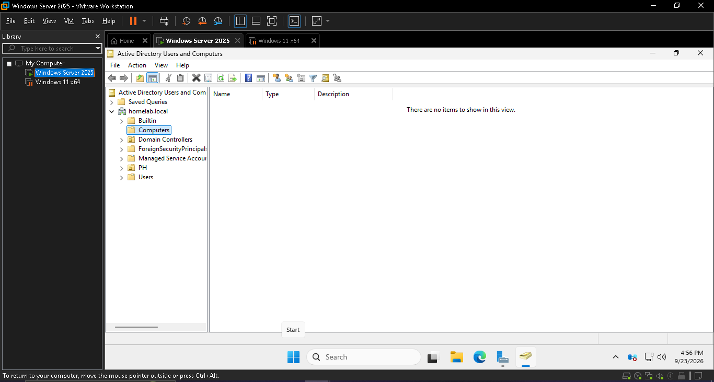
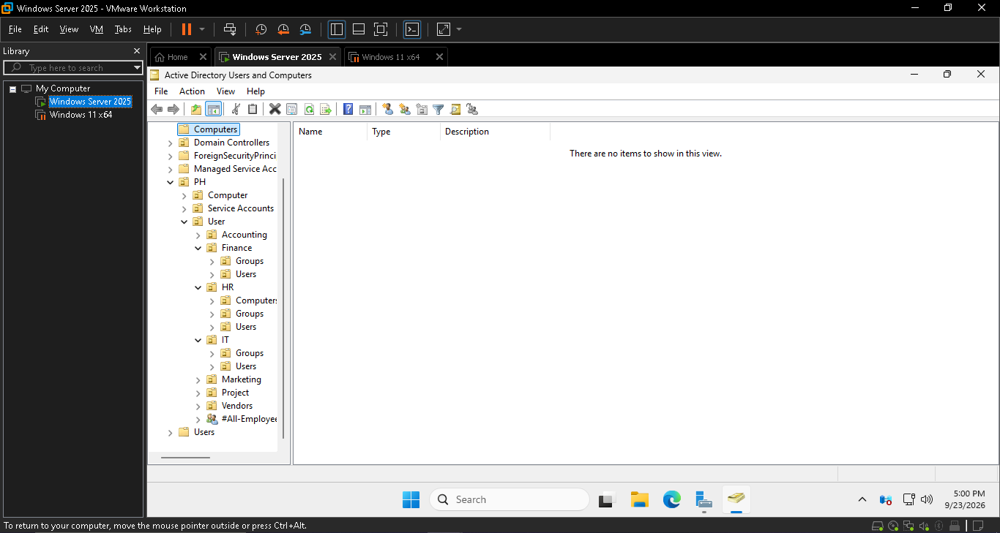
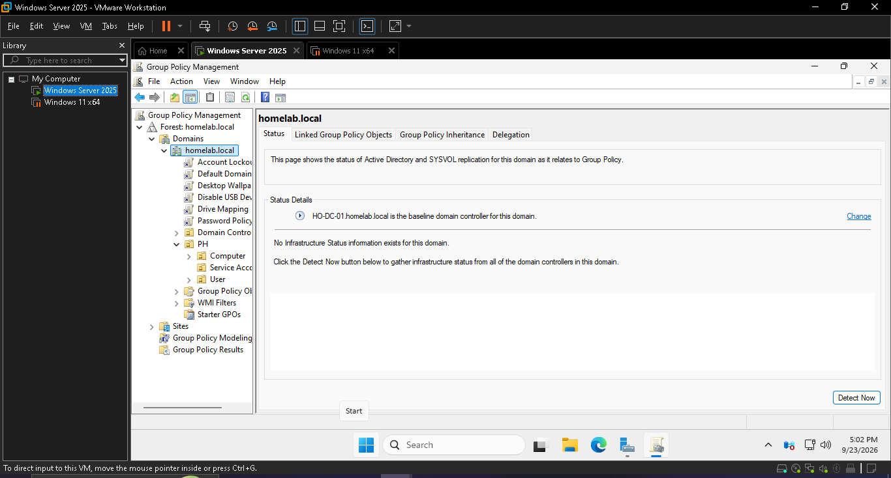
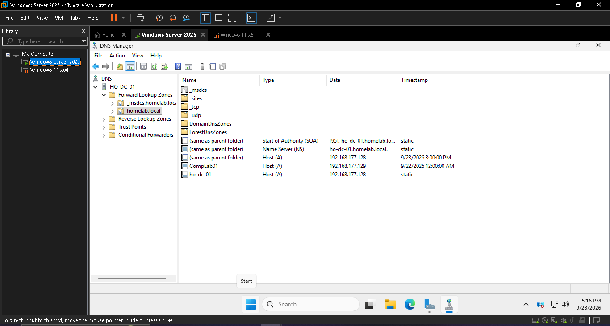
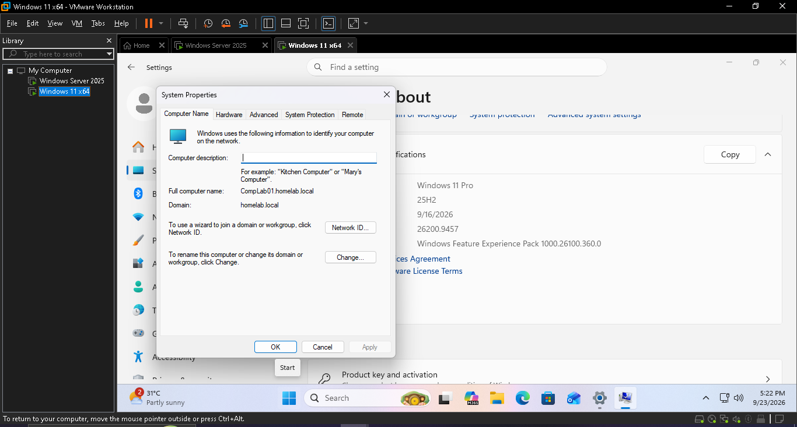
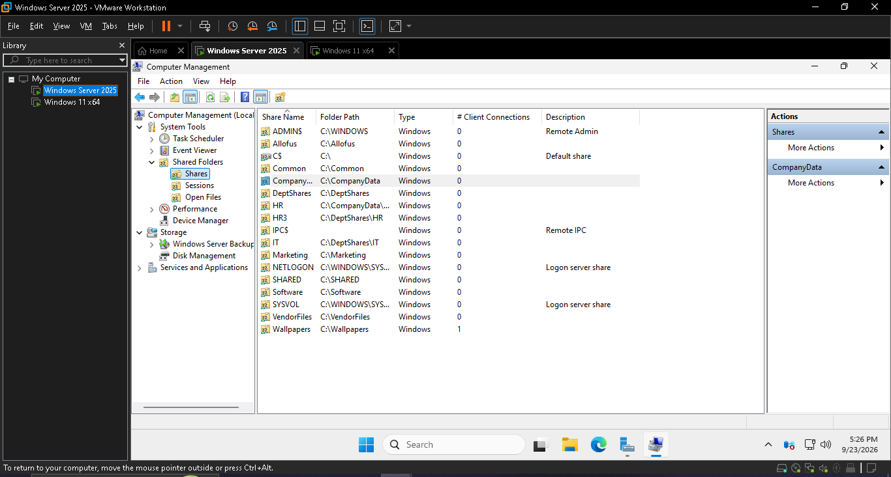
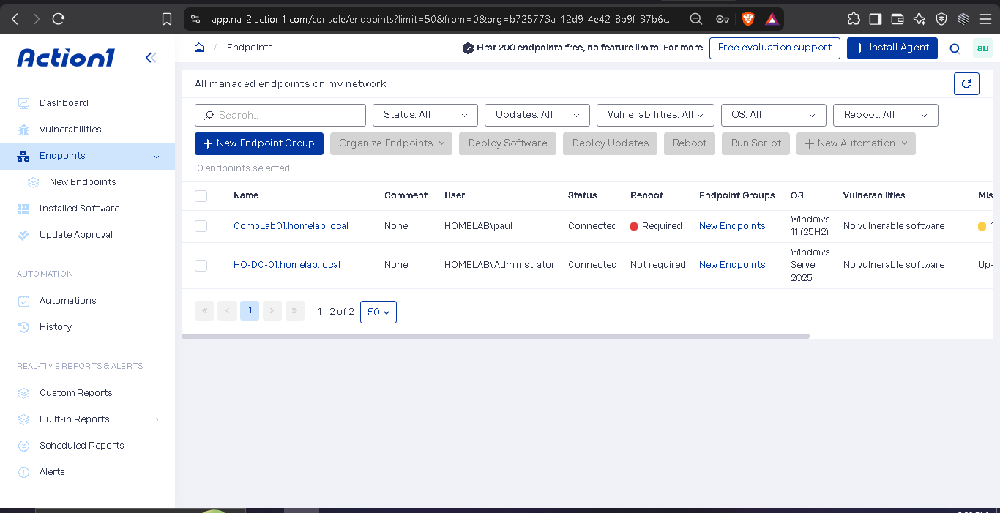

# Windows-Server-Active-Directory-Homelab

A hands-on IT support and system administration home lab built using VMware Workstation Pro. The lab was created to practice Windows Server, Active Directory, Group Policy, DNS, file sharing, permissions, and Windows client administration.

## Lab Environment

- VMware Workstation Pro
- Windows Server 2025
- Windows 11 Pro
- Active Directory Domain Services (AD DS)
- DNS
- Group Policy
- Action1 RMM

## Objectives
The goal of this lab was to gain practical experience with common Windows Server and IT support tasks in a virtualized environment.

## What I practiced
1. Virtual Machine Setup
- Created a Windows Server 2025 virtual machine.
- Created a Windows 11 Pro client virtual machine.
- Configured the virtual machines to communicate within the lab environment.

2. Windows Server
- Installed and configured Windows Server 2025.
- Configured the server for Active Directory services.
- Installed the Active Directory Domain Services role.
- Configured DNS for the domain environment.

3. Active Directory
- Created an Active Directory domain.
- Created Organizational Units (OUs).
- Created and managed user accounts.
- Managed user passwords.
- Created security groups.
- Added users to security groups.

4. Group Policy
Created and configured Group Policy Objects (GPOs) to practice centralized management of Windows clients.

Examples of Policies configured:
- Account lockout policies
- Desktop restrictions
- Network drive mapping

5. Windows 11 Domain client
- Joined the Windows 11 client to the Active Directory domain.
- Logged in using domain accounts.
- Tested Group Policy settings from the Windows Server.
- Practiced managing the Windows client through the domain environment.

6. File Sharing and Permissions
- Created shared folders.
- Configured Windows file sharing.
- Configured Share permissions.
- Configured NTFS permissions.
- Tested access using different users and groups.
- Practiced accessing shared resources through the network.

7. Action1 RMM
I installed the Action1 agent on both the Windows Server and Windows 11 virtual machines to practice connecting devices to an RMM platform.

## 1. VMware Lab Setup

- Set up the Windows Server and Windows 11 client virtual machines using VMware Workstation.

## 2. Active Directory

- Configured Active Directory Domain Services (AD DS) and used Active Directory Users and Computers to manage the domain environment.

## 3. Organizational Units

- Created and organized Organizational Units (OUs) for managing users and computers within the Active Directory environment.

## 4. Group Policy

- Created and applied basic Group Policy settings to practice centralized management of Windows client settings.

## 5. DNS

- Configured and verified DNS as part of the Active Directory environment. This helped the domain and client machines communicate and resolve names within the lab network.

## 6. Domain-Joined Client

- Joined the Windows 11 client machine to the Active Directory domain and verified the domain membership.

## 7. File Sharing

- Configured a shared folder on the Windows Server and practiced basic sharing and permission settings for network access.

## 8. Action1

- Connected the Windows client to Action1 to practice basic endpoint management and monitoring using an RMM platform.

